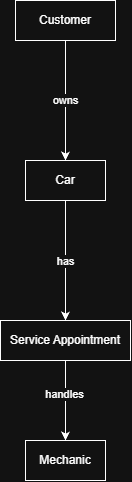

New folder# INFOMAN1 – Week 2 Lab: Conceptual ERD Case Study
**Name:** Adrian Lacsamana
**Student ID:** 2510955
**Section:** BSIT-II

## Task 1 — Candidate Entities

| Entity | Justification |
|---|---|
| Customer | The scenario states that the shop has many customers and each customer may bring one or more cars, so Customer is a distinct entity with its own information. |
| Car | The scenario states that each car has a model, plate number, and color and belongs to a customer, so Car is a separate entity that can exist in multiple records. |
| Mechanic | The scenario states that the shop employs several mechanics and each mechanic has a name and specialty, so Mechanic is a distinct entity with its own information. |
| Service Appointment | The scenario states that a scheduled service appointment has a date and a repair note, so it represents a specific service event and should be treated as an entity. |

## Task 2 — Attributes per Entity

### Customer
- Primary Key: customer_id
- Attributes:
  - customer_id — Domain: integer
  - name — Domain: text
  - contact_number — Domain: text

### Car
- Primary Key: car_id
- Attributes:
  - car_id — Domain: integer
  - model — Domain: text
  - plate_number — Domain: text
  - color — Domain: text

### Mechanic
- Primary Key: mechanic_id
- Attributes:
  - mechanic_id — Domain: integer
  - name — Domain: text
  - specialty — Domain: text

### Service Appointment
- Primary Key: appointment_id
- Attributes:
  - appointment_id — Domain: integer
  - service_date — Domain: date
  - repair_note — Domain: text

## Task 3 — Relationships

| Relationship (verb phrase) | Between | Cardinality | Checked both directions? |
|---|---|---|---|
| owns | Customer - Car | 1:N | Yes — one customer may own many cars, while each car belongs to exactly one customer. |
| has | Car - Service Appointment | 1:N | Yes - one car may have many service appointments over time, while each appointment is for one car. |
| handles | Mechanic - Service Appointment | 1:N | Yes - one mechanic may handle many appointments, while each appointment is handled by one mechanic. |

The scenario also implies that Mechanic and Car can have a many-to-many relationship over time. This is represented through Service Appointment, which records the specific visit between a mechanic and a car.

## Task 4 — Conceptual ERD

